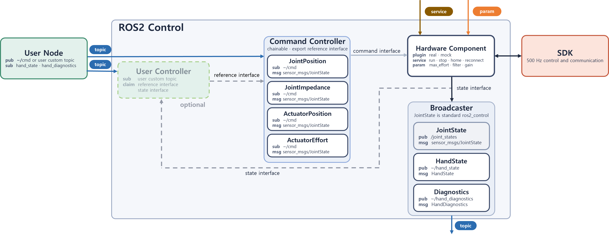
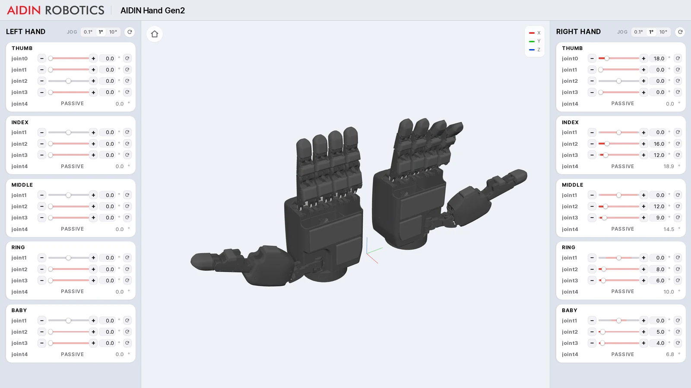

<h1>AIDIN Hand Gen2 ROS 2</h1>

AIDIN Hand Gen2를 ROS 2에서 제어하는 `ros2_control` wrapper입니다. controller에 목표값을 보내고,
상태 topic으로 결과를 확인하며, service로 homing·정지·복구를 요청할 수 있습니다.
로봇 핸드 없이 실행할 수 있는 mock과 기존 로봇에 통합하기 위한 URDF·launch 설정을 제공합니다.

  

[Install](docs/ko/03_installation.md) | [Documentation](#documentation) | [Changelog](CHANGELOG.md) | [Official Site](https://www.aidinrobotics.co.kr/) | [English](README.md) | 한국어

## System requirements

아래는 wrapper의 빌드·실행이 검증된 구성입니다.

| Component | Requirement |
|---|---|
| Operating System | Ubuntu 22.04 |
| ROS 2 | Humble |
| Control framework | `ros2_control` |
| SDK | `aidin_hand2` 0.6.x ([`aidin_hand2.repos`](aidin_hand2.repos)) |
| CAN interface | 로봇 핸드 구동 시 USB CAN-FD adapter (SocketCAN), nominal 1 Mbit/s, data phase 5 Mbit/s |

## Architecture

[ros2_control](https://control.ros.org/humble/index.html)을 기반으로 로봇 핸드 제어를 위한 controller와 상태 관측을 위한 broadcaster를 제공합니다.

사용자 node가 command를 보내는 경로는 둘입니다.

- command controller의 `~/cmd` topic에 `sensor_msgs/JointState` message를 직접 보냅니다. 이름 대조 규칙과
  읽는 필드·단위는 [2. Command message](aidin_hand2_msgs/README.ko.md#2-command-message)에 있습니다.
- user controller를 만들어 직접 정의한 topic과 message로 보냅니다. user controller는 command를
  처리해 목표값을 command controller의 reference interface에 쓰고, 그동안 command controller는 chained
  mode가 되어 자기 `~/cmd` topic을 읽지 않습니다. reference 이름과 mode 전환 순서는
  [6. Chaining](aidin_hand2_controllers/README.ko.md#6-chaining)에 있습니다.

어느 경로든 한 손에 active인 command controller는 하나입니다.

user controller는 controller_manager 안에서 작동하기 때문에 actuator 위치·joint 각도·tactile 같은 상태를
topic이 아니라 state interface로 같은 cycle 안에서 읽을 수 있습니다. 상태 관측과 목표값 계산이 500 Hz
cycle 하나에서 닫히므로 topic 왕복이 없는 제어 루프가 됩니다. `aidin_hand2_examples` package의 skeleton이 이
틀이고, 알고리즘 자리에는 입력에 0을 곱하는 한 줄이 들어 있습니다. 읽을 수 있는 state interface
목록과 실행 절차는 [Chainable controller examples](aidin_hand2_examples/EXAMPLE.md)에 있습니다.

user node는 상태를 `/joint_states`, `~/hand_state`, `~/hand_diagnostics` topic으로 읽습니다. `~`는 해당
topic이나 service를 제공하는 node 이름입니다. 예를 들어 `~/cmd` topic은 `/left_joint_position_controller/cmd`가 됩니다.
effort 상한과 filter·gain은 hardware node의 ROS parameter로 설정합니다.

## Terms

문서 전체가 쓰는 ros2_control 용어입니다. 처음 보신다면 여기서 뜻을 확인하고 읽으십시오. 자세한
정의는 [ros2_control 문서](https://control.ros.org/humble/index.html)에 있습니다.

| 용어 | 뜻 |
|---|---|
| controller_manager | controller를 올리고 내리고 매 cycle 실행하는 node입니다. 이 wrapper에서는 launch가 띄웁니다 |
| hardware component | 하드웨어와 통신하며 상태를 읽고 목표값을 쓰는 plugin입니다. 종류는 System·Actuator·Sensor 셋이며, wrapper는 SDK를 호출하는 System을 로봇 핸드마다 하나씩 제공하고 이름은 `{side}_hand_control`입니다 |
| hardware node | hardware component가 띄우는 node입니다. `~/run`·`~/stop`·`~/home`·`~/reconnect` service와 effort·filter·gain parameter를 제공합니다 |
| controller | hardware component 위에서 매 cycle 실행되어 목표값을 만들거나 관측값을 발행합니다 |
| broadcaster | 목표값을 만들지 않고 관측값만 topic으로 발행하는 controller입니다 |
| `unconfigured` · `inactive` · `active` | ROS 2 managed node의 상태 이름이고 controller와 hardware component가 각각 가집니다. controller가 `active`면 매 cycle 실행되고, hardware component가 `active`면 drive에 토크가 걸려 움직일 수 있습니다. `inactive`는 올라와 있지만 그렇지 않은 상태이며 `unconfigured`는 그 앞 단계입니다 |
| command interface | controller가 목표값을 쓰는 자리입니다. 한 번에 하나의 controller만 점유할 수 있습니다 |
| state interface | 관측값을 읽는 자리입니다. 여럿이 함께 읽을 수 있습니다 |
| reference interface | command controller가 상위 controller에게 열어 주는 입력입니다. 여기에 목표값이 들어오면 자기 topic 대신 이 값을 씁니다 |
| chained mode | command controller가 reference interface의 값을 쓰는 상태입니다 |
| spawner | controller를 controller_manager에 올리는 실행 파일입니다. launch가 controller마다 하나씩 실행합니다 |

`active` 상태는 controller와 hardware component 양쪽에 쓰이고, SDK가 보고하는 lifecycle과도 다릅니다. 셋을
구별하는 표는 [1. Lifecycle](docs/ko/05_control_guide.md#1-lifecycle)에 있습니다.

## Getting started

목적에 맞는 경로로 시작하십시오. 설치와 mock 실행에는 로봇 핸드나 CAN adapter가 필요하지 않습니다.

| Goal | Reading order |
|---|---|
| 로봇 핸드 없이 확인 | [Installation](docs/ko/03_installation.md) → [1. Mock](docs/ko/04_bringup.md#1-mock) |
| 로봇 핸드 구동 | [Installation](docs/ko/03_installation.md) → [Real-time kernel setup](docs/ko/01_real_time_kernel_setup.md)·[CAN-FD setup](docs/ko/02_can_fd_setup.md) → [2. Robot hand](docs/ko/04_bringup.md#2-robot-hand) |
| 실행 중인 로봇 핸드 제어 | [Control guide](docs/ko/05_control_guide.md) — 상태 확인 → homing → 목표 전송 → 관측·정지 |
| 기존 로봇에 통합 | 단독 [Bringup](docs/ko/04_bringup.md) 확인 → [Add to your robot](aidin_hand2_bringup/README.ko.md#7-add-to-your-robot) |

문서에서 쓰는 관절 이름과 회전 방향은 아래 뷰어에서 직접 움직여 확인할 수 있습니다.

## Documentation

설치·첫 실행·제어는 공통 안내를 따라 진행하십시오. package별 README는 설정과 상세 참조를 제공합니다.

### User guides

- [Installation](docs/ko/03_installation.md) — SDK 설치와 wrapper 빌드
- [Real-time kernel setup](docs/ko/01_real_time_kernel_setup.md) — PREEMPT_RT kernel과 실시간 실행 권한
- [CAN-FD setup](docs/ko/02_can_fd_setup.md) — CAN interface 설정과 수신 확인
- [Bringup](docs/ko/04_bringup.md) — mock·로봇 핸드의 첫 실행, homing, 첫 command, 정지
- [Control guide](docs/ko/05_control_guide.md) — lifecycle, topic 목표 전송, service 호출, 관측·정지·복구, QoS
- [Troubleshooting](docs/ko/06_troubleshooting.md) — 빌드·실행·제어·통신 문제 해결

### Packages

| Package | Guide |
|---|---|
| [aidin_hand2_bringup](aidin_hand2_bringup/README.ko.md) | launch 인자·기본값, 설정 파일, 기존 로봇에 추가하는 순서 |
| [aidin_hand2_description](aidin_hand2_description/README.ko.md) | URDF·xacro 파일 위치, 매크로 호출·인자, RViz 시각화 |
| [aidin_hand2_controllers](aidin_hand2_controllers/README.ko.md) | controller 선택·입력·전환, chaining, controller YAML·설정값 |
| [aidin_hand2_hardware](aidin_hand2_hardware/README.ko.md) | homing·정지·복구 service, effort·filter·gain 변경과 초기 설정 |
| [aidin_hand2_msgs](aidin_hand2_msgs/README.ko.md) | command·상태 message 필드·단위, joint·actuator 배열 순서 |
| [aidin_hand2_examples](aidin_hand2_examples/README.ko.md) | user controller skeleton, 소스·설정 파일, 알고리즘 연결 |

## Related repositories

- [aidin-hand2-sdk](https://github.com/aidinrobotics/aidin-hand2-sdk) — C++ SDK

SDK 문서 중 wrapper 사용자가 함께 보는 것은 셋입니다.

- [C++ guide](https://github.com/aidinrobotics/aidin-hand2-sdk/blob/main/docs/ko/07_cpp_usage_guide.md) — wrapper가 드러내는 lifecycle·homing·command의 뜻
- [Workspace limits](https://github.com/aidinrobotics/aidin-hand2-sdk/blob/main/docs/ko/14_workspace_limits.md) — joint 목표가 투영되는 도달 범위
- [Error messages](https://github.com/aidinrobotics/aidin-hand2-sdk/blob/main/docs/ko/15_error_messages.md) — 실패한 service가 돌려주는 문구
