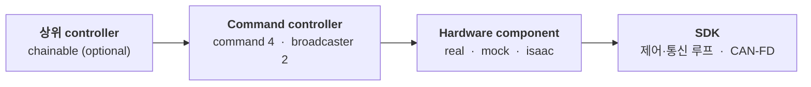

<div align="center">

<a href="https://www.aidinrobotics.co.kr/"></a>

<h1>AIDIN Hand Gen2 ROS 2</h1>

AIDIN Hand Gen2 C++ SDK의 `ros2_control` wrapper입니다. CAN-FD 통신, drive state machine, kinematics, 500 Hz 제어·통신 루프는 SDK가 담당하고, wrapper는 hardware plugin, controller, message, URDF, launch 파일을 제공합니다.

[](CHANGELOG.md) [](aidin_hand2.repos) [](#system-requirements)

[Build](#build-from-source) | [Documentation](#documentation) | [Changelog](CHANGELOG.md) | [Official Site](https://www.aidinrobotics.co.kr/) | [English](README.md) | 한국어

</div>

## Architecture

wrapper는 제어 알고리즘을 더하지 않습니다.



command controller 4개가 `~/command` topic 또는 상위 controller의 reference를 SDK command 하나로 바꾸고, broadcaster 2개가 관측과 진단을 발행합니다. message 하나가 로봇 핸드 하나의 목표 16개를 모두 담고, effort 상한과 controller tuning은 hardware component가 자기 node에 두는 parameter입니다.

## System Requirements

아래는 wrapper의 build·실행이 검증된 구성입니다.

| Component | Requirement |
|---|---|
| Operating System | Ubuntu 22.04 |
| ROS 2 | Humble |
| Control framework | `ros2_control` |
| SDK | `aidin_hand2` 0.5.x. [`aidin_hand2.repos`](aidin_hand2.repos)에 고정 |
| CAN interface | USB CAN-FD adapter (SocketCAN), nominal 1 Mbit/s, data phase 5 Mbit/s |

## Packages

저장소가 담는 package는 6개입니다.

| Package | Role |
|---|---|
| `aidin_hand2_hardware` | 로봇 핸드·mock·Isaac Sim의 `SystemInterface`. SDK lifecycle과 service 4개 |
| `aidin_hand2_controllers` | command controller 4개, `HandStateBroadcaster`, `DiagnosticsBroadcaster` |
| `aidin_hand2_msgs` | command message 4개, `CommandState`, `HandState`, `HandDiagnostics` |
| `aidin_hand2_description` | URDF, xacro 매크로, mesh, `ros2_control` description |
| `aidin_hand2_bringup` | 로봇 핸드·mock·Isaac Sim의 launch 파일과 controller 설정 |
| `aidin_hand2_examples` | chainable 상위 controller skeleton 4개 |

## Build from source

먼저 [Real-time kernel setup](docs/ko/01_real_time_kernel_setup.md)과 [CAN-FD setup](docs/ko/02_can_fd_setup.md)으로 host를 준비하고, [Installation](docs/ko/03_installation.md)대로 SDK를 install하고 wrapper를 build합니다. 아래는 절차의 요약입니다.

```bash
sudo apt install -y ros-dev-tools ros-humble-ros2controlcli
cd ~/your_ws/src/aidin-hand2-ros2
vcs import .. < aidin_hand2.repos          # SDK가 ~/your_ws/src/aidin-hand2-sdk에 clone됩니다
```

SDK는 SDK 문서의 [SDK build & install](https://github.com/aidinrobotics/aidin-hand2-sdk/blob/main/docs/ko/06_sdk_build_and_install.md)대로 build·install하고, configure할 때 로봇 핸드의 kinematics에 맞는 값을 고릅니다. 그다음 wrapper를 build합니다.

```bash
cd ~/your_ws
source /opt/ros/humble/setup.bash
rosdep install --from-paths src/aidin-hand2-ros2 --ignore-src --rosdistro humble -y
colcon build --symlink-install --cmake-args -DCMAKE_BUILD_TYPE=RelWithDebInfo
source install/setup.bash
```

## Quick start

`aidin_hand2_bringup` package는 로봇 핸드를 단독으로 실행해 설치와 하드웨어를 확인하는 launch를 제공합니다. 하드웨어가 필요 없는 mock부터 시작합니다.

```bash
ros2 launch aidin_hand2_bringup aidin_hand2_mock.launch.py
```

다른 terminal에서 controller를 확인합니다.

```bash
ros2 control list_controllers
```

로봇 핸드는 homing 없이 실행하고, 주변을 비운 뒤 `~/home` service를 호출합니다. 전체 절차는 [Bringup](docs/ko/04_bringup.md)에 있습니다.

```bash
ros2 launch aidin_hand2_bringup aidin_hand2.launch.py \
  use_right_hand:=false left_hand_interface:=can0 auto_home:=false
```

## Integration

로봇 핸드를 자기 로봇에 붙일 때는 launch 파일 대신 xacro 매크로 둘을 자기 URDF에서 호출합니다. 하나는 링크와 mesh를 넣고 다른 하나는 `ros2_control` hardware component를 선언합니다.

```xml
<xacro:include filename="$(find aidin_hand2_description)/urdf/aidin_hand2_left.urdf.xacro"/>
<xacro:include filename="$(find aidin_hand2_description)/ros2_control/aidin_hand2.ros2_control.xacro"/>

<xacro:aidin_hand2_left prefix="left_" parent="your_tool_link">
  <origin xyz="0 0 0" rpy="0 0 0"/>
</xacro:aidin_hand2_left>

<xacro:aidin_hand2_ros2_control
  name="left_hand_control" prefix="left_" hand_side="left"
  can_interface="can0" auto_home="false"/>
```

controller는 자기 `controllers.yaml`에 선언합니다. command controller는 한 순간 하나만 active이고, command는 command controller의 `~/command` topic 또는 chaining할 때 reference interface로 전달됩니다. 절차는 [Integration](docs/ko/05_integration.md)에 있습니다.

## Documentation

문서는 한국어로 쓰고 영문판을 준비하고 있습니다. 문서는 setup, interface, 부록 세 묶음입니다.

### Setup

- [Real-time kernel setup](docs/ko/01_real_time_kernel_setup.md) — PREEMPT_RT kernel과 real-time permission
- [CAN-FD setup](docs/ko/02_can_fd_setup.md) — interface bring-up과 wrapper에서의 지정
- [Installation](docs/ko/03_installation.md) — SDK install과 wrapper build
- [Bringup](docs/ko/04_bringup.md) — mock, 로봇 핸드, homing, 첫 command, 정지
- [Integration](docs/ko/05_integration.md) — 자기 로봇의 URDF와 controller 구성에 넣기

### Interfaces

- [Controllers](docs/ko/06_controllers.md) — hardware component, lifecycle, command interface, mode 전환, chaining, NaN 규칙
- [Services](docs/ko/07_services.md) — `~/run` `~/stop` `~/home` `~/reconnect`, homing, 복구, 종료
- [Topics](docs/ko/08_topics.md) — command topic, `HandState`, `CommandState`, `HandDiagnostics`, 감시
- [Parameters](docs/ko/09_parameters.md) — 매크로 parameter, hardware node parameter, controller parameter
- [Launch files](docs/ko/10_launch_files.md) — launch 파일과 인자, config 파일
- [Chainable examples](aidin_hand2_examples/EXAMPLE.md) — 상위 controller skeleton

### Appendix

- [Interface matrix](docs/ko/11_interface_matrix.md) — 모든 interface 이름
- [Troubleshooting](docs/ko/12_troubleshooting.md) — build부터 통신까지 층별 증상

## Related repositories

- [aidin-hand2-sdk](https://github.com/aidinrobotics/aidin-hand2-sdk) — C++ SDK. [C++ guide](https://github.com/aidinrobotics/aidin-hand2-sdk/blob/main/docs/ko/07_cpp_usage_guide.md)가 이 wrapper가 드러내는 lifecycle·homing·command의 뜻을, [Workspace limits](https://github.com/aidinrobotics/aidin-hand2-sdk/blob/main/docs/ko/14_workspace_limits.md)가 joint 목표가 투영되는 도달 범위를, [Error messages](https://github.com/aidinrobotics/aidin-hand2-sdk/blob/main/docs/ko/15_error_messages.md)가 실패한 service가 돌려주는 문구를 설명합니다.
