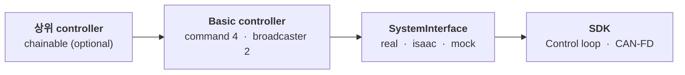

<div align="right"><sub><a href="README.md">English</a></sub></div>

# AIDIN Hand Gen2 ROS 2 &nbsp;[](CHANGELOG.md) [](aidin_hand2.repos) [](#지원-범위)

AIDIN Hand Gen2 C++ SDK를 `ros2_control`에 연결하는 thin wrapper입니다. CAN-FD protocol, drive state machine, kinematics와 500 Hz hand control loop는 SDK가 소유하며 이 repository는 hardware plugin, controller, message, URDF와 launch를 제공합니다.

## 구조



새 controller 계층을 추가하지 않습니다. 기존 네 basic controller가 ROS topic 또는 상위 controller reference를 SDK의 완전한 typed command로 바꾸는 command-port adapter입니다.

Standalone에서는 각 controller의 `~/command`에 한 cycle의 target을 모두 담아 보냅니다. 네 mode 모두 16개 배열 하나가 한 message이고 partial update는 허용하지 않습니다. Effort 상한과 controller tuning(JointPosition filter·JointImpedance gain)은 command가 아니라 hardware node parameter입니다.

## 지원 범위

| 항목 | 대상 |
|---|---|
| OS | Ubuntu 22.04 |
| ROS 2 | Humble |
| Control framework | `ros2_control` |
| SDK | `aidin_hand2` 0.4.x — [`aidin_hand2.repos`](aidin_hand2.repos) 참조 |
| CAN interface | USB CAN-FD adapter (SocketCAN), nominal 1 Mbit/s / data phase 5 Mbit/s |

실물 host의 PREEMPT_RT와 boot-time CAN-FD 설정은 SDK의 [real-time kernel setup](https://github.com/aidinrobotics/aidin-hand2-sdk/blob/main/docs/ko/04_real_time_kernel_setup.md)과 [CAN-FD setup](https://github.com/aidinrobotics/aidin-hand2-sdk/blob/main/docs/ko/05_can_fd_setup.md)을 먼저 완료하십시오.

## Package

| Package | 역할 |
|---|---|
| `aidin_hand2_hardware` | 실제·Isaac Sim·mock `SystemInterface`, SDK lifecycle mapping |
| `aidin_hand2_controllers` | 4개 command controller, 2개 broadcaster |
| `aidin_hand2_msgs` | 4개 typed command, `CommandState`, `HandState`, `HandDiagnostics` |
| `aidin_hand2_description` | URDF, xacro, mesh, ros2_control description |
| `aidin_hand2_bringup` | 실제·Isaac Sim·mock launch와 controller config |
| `aidin_hand2_examples` | 4개 chainable 상위 controller skeleton |

## 빌드

SDK를 먼저 build하고 install합니다. 검증된 revision은 `aidin_hand2.repos`에 고정돼 있습니다.

```bash
vcs import .. < aidin_hand2.repos
```

```bash
cd <aidin-hand2-sdk clone 경로>
cmake -S cpp -B cpp/build -DCMAKE_BUILD_TYPE=RelWithDebInfo
cmake --build cpp/build -j"$(nproc)"
sudo cmake --install cpp/build
```

Sudo를 쓰지 않으려면 사용자 prefix에 install하고 그 경로를 `CMAKE_PREFIX_PATH`에 넣습니다.

```bash
cmake --install cpp/build --prefix "$HOME/.local"
export CMAKE_PREFIX_PATH="$HOME/.local${CMAKE_PREFIX_PATH:+:$CMAKE_PREFIX_PATH}"
```

ROS 2 environment를 적용하고 workspace root에서 wrapper를 build합니다. `/usr/local`에 install했다면 CMake 기본 탐색 경로이므로 `CMAKE_PREFIX_PATH` 설정이 필요 없습니다.

```bash
cd ~/your_ws
source /opt/ros/humble/setup.bash

colcon build --symlink-install --cmake-args -DCMAKE_BUILD_TYPE=RelWithDebInfo
source install/setup.bash
```

## 빠른 시작

`aidin_hand2_bringup`은 손을 단독 실행하는 예제입니다. 하드웨어 확인용이며 통합 경로가
아닙니다. 실물보다 먼저 mock을 실행합니다.

```bash
ros2 launch aidin_hand2_bringup aidin_hand2_mock.launch.py
ros2 control list_controllers
```

실물은 homing 없이 시작하고, 작업 공간을 확인한 뒤에만 homing을 trigger합니다.
자세한 절차는 [첫 bringup](docs/ko/02_first_bringup.md)에 있습니다.

```bash
ros2 launch aidin_hand2_bringup aidin_hand2.launch.py auto_home:=false
```

## 통합

손을 자기 로봇에 붙일 때는 launch를 쓰지 않고 xacro 매크로 두 개를 자기 URDF에 include합니다.
하나는 링크·mesh를 넣고 다른 하나는 `ros2_control` system을 선언합니다. 기하 매크로는 side별로
나뉘고(`aidin_hand2_left` / `aidin_hand2_right`), `ros2_control` 매크로는 `hand_side`로 받습니다.
`can_interface`와 identity 3개가 필수이고 나머지는 SDK 기본값을 따릅니다.

```xml
<xacro:include filename="$(find aidin_hand2_description)/urdf/aidin_hand2_left.urdf.xacro"/>
<xacro:include filename="$(find aidin_hand2_description)/ros2_control/aidin_hand2.ros2_control.xacro"/>

<xacro:aidin_hand2_left prefix="left_" parent="your_tool_link">
  <origin xyz="0 0 0" rpy="0 0 0"/>
</xacro:aidin_hand2_left>

<xacro:aidin_hand2_ros2_control
  name="left_hand" prefix="left_" hand_side="left"
  can_interface="can0" auto_home="false"/>
```

Controller는 자기 `controllers.yaml`에 선언합니다. Command controller는 mode별 interface를
claim하므로 한 순간 하나만 active여야 하고, 명령은 각 controller의 `~/command` topic 또는
chaining 시 reference interface로 보냅니다.

전체 파라미터 계약과 두 명령 경로는 [ros2_control 설정](docs/ko/03_setup.md)에 있습니다.

## 문서

### 시작하기

- [설치](docs/ko/01_installation.md) — 사전 조건, 의존성, SDK·wrapper build
- [첫 bringup](docs/ko/02_first_bringup.md) — mock, 실물, homing, 첫 command, 종료

### 사용

- [ros2_control 설정](docs/ko/03_setup.md) — xacro 매크로 계약과 controller 선언
- [Interface](docs/ko/04_interfaces.md) — Topic·service·reference interface와 명령 예시
- [Bringup 예제](docs/ko/05_bringup_example.md) — 단독 실행 launch와 argument
- [Chainable 예제](aidin_hand2_examples/EXAMPLE.md) — 상위 controller skeleton

### 운영

- [운영과 복구](docs/ko/06_operations.md) — Lifecycle, auto reconnect, RT, monitoring, 복구
- [문제 해결](docs/ko/07_troubleshooting.md) — Build, launch, controller, stale state, CAN 진단

### 부록

- [Interface matrix](docs/ko/08_interface_matrix.md) — 전체 interface 이름 목록

## 관련 repository

- [aidin-hand2-sdk](https://github.com/aidinrobotics/aidin-hand2-sdk) — C++ SDK
- Web GUI (pending) — browser GUI와 WebSocket bridge

### 함께 봐야 하는 SDK 문서

Host 준비, kinematics, 안전 계약은 SDK가 소유하며 이 wrapper는 반복하지 않습니다.

- [Real-time kernel setup](https://github.com/aidinrobotics/aidin-hand2-sdk/blob/main/docs/ko/04_real_time_kernel_setup.md) — PREEMPT_RT, 실물 전 필수
- [CAN-FD setup](https://github.com/aidinrobotics/aidin-hand2-sdk/blob/main/docs/ko/05_can_fd_setup.md) — Interface bring-up과 boot 자동화
- [SDK build·install](https://github.com/aidinrobotics/aidin-hand2-sdk/blob/main/docs/ko/06_sdk_build_and_install.md) — 이 wrapper가 소비하는 build
- [Workspace limits](https://github.com/aidinrobotics/aidin-hand2-sdk/blob/main/docs/ko/14_workspace_limits.md) — 결합 workspace 경계와 명령 clamp
- [안전과 fault 대응](https://github.com/aidinrobotics/aidin-hand2-sdk/blob/main/docs/ko/13_safety.md) — 명령 지속성과 통신 두절 동작
- [문제 해결](https://github.com/aidinrobotics/aidin-hand2-sdk/blob/main/docs/ko/15_troubleshooting.md) — 연결·RT·homing·CAN 오류
