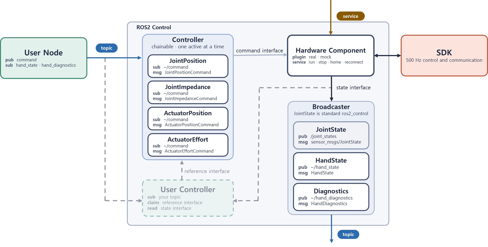

<h1>AIDIN Hand Gen2 ROS 2</h1>

AIDIN Hand Gen2를 ROS 2에서 제어하는 `ros2_control` wrapper입니다. controller에 목표값을 보내고,
상태 topic으로 결과를 확인하며, service로 homing·정지·복구를 요청할 수 있습니다.
로봇 핸드 없이 실행할 수 있는 mock과 기존 로봇에 통합하기 위한 URDF·launch 설정을 제공합니다.

  

[Install](docs/ko/03_installation.md) | [Documentation](#documentation) | [Changelog](CHANGELOG.md) | [Official Site](https://www.aidinrobotics.co.kr/) | [English](README.md) | 한국어

## Architecture

[ros2_control](https://control.ros.org/humble/index.html)을 기반으로 로봇 핸드 제어를 위한 controller와 상태 관측을 위한 broadcaster를 제공합니다.

사용자 node는 command controller의 topic에 직접 목표값을 보내거나, 상위 controller의 입력 topic에
목표값을 보낼 수 있습니다. 상위 controller는 목표를 처리해 command controller의 reference interface에
전달합니다. 한 손에는 command controller 하나를 활성화하며, chained mode에서는 하위 controller의
직접 command topic 입력을 사용하지 않습니다.

상위 controller의 topic 이름과 message 타입은 해당 구현에 따릅니다.
제공된 `aidin_hand2_examples` skeleton에는 목표 입력 subscriber가 없으므로 직접 추가해야 합니다.
상태는 `/joint_states`, `~/hand_state`, `~/hand_diagnostics`로 읽습니다. `~`는 해당 topic이나 service를
제공하는 node 이름입니다. 예를 들어 `~/command`는 `/left_joint_position_controller/command`가 됩니다.
effort 상한과 filter·gain은 ROS parameter로 설정합니다.

## Getting started

목적에 맞는 경로로 시작하십시오. 설치와 mock 실행에는 로봇 핸드나 CAN adapter가 필요하지 않습니다.

| Goal | Reading order |
|---|---|
| 로봇 핸드 없이 확인 | [Installation](docs/ko/03_installation.md) → [1. Mock](docs/ko/04_bringup.md#1-mock) |
| 로봇 핸드 구동 | [Installation](docs/ko/03_installation.md) → [Real-time kernel setup](docs/ko/01_real_time_kernel_setup.md)·[CAN-FD setup](docs/ko/02_can_fd_setup.md) → [2. Robot hand](docs/ko/04_bringup.md#2-robot-hand) |
| 실행 중인 로봇 핸드 제어 | [Control guide](docs/ko/05_control_guide.md) — 상태 확인 → homing → 목표 전송 → 관측·정지 |
| 기존 로봇에 통합 | 단독 [Bringup](docs/ko/04_bringup.md) 확인 → [Add to your robot](aidin_hand2_bringup/README.ko.md#7-add-to-your-robot) |

## System requirements

아래는 wrapper의 빌드·실행이 검증된 구성입니다.

| Component | Requirement |
|---|---|
| Operating System | Ubuntu 22.04 |
| ROS 2 | Humble |
| Control framework | `ros2_control` |
| SDK | `aidin_hand2` 0.5.x ([`aidin_hand2.repos`](aidin_hand2.repos)) |
| CAN interface | 로봇 핸드 구동 시 USB CAN-FD adapter (SocketCAN), nominal 1 Mbit/s, data phase 5 Mbit/s |

## Lifecycle

lifecycle은 로봇 핸드의 연결·제어 상태입니다. `hand_diagnostics.lifecycle`에서 읽으며,
`ros2 control`이 표시하는 controller·hardware component의 `active`와 구분합니다.
command를 적용하려면 controller가 `active`, lifecycle이 `Running`, homing이 `Succeeded`여야 합니다.

`run`은 제어 시작, `stop`은 quick stop, `home`은 원점 설정, `reconnect`는 통신 오류 복구를 요청합니다.
상태별 의미와 실제 topic·service 명령은 [Control guide](docs/ko/05_control_guide.md)에서 이어서 설명합니다.

## Documentation

설치·첫 실행·제어는 공통 안내를 따라 진행하십시오. package별 README는 설정과 상세 참조를 제공합니다.

### User guides

- [Installation](docs/ko/03_installation.md) — SDK 설치와 wrapper 빌드
- [Real-time kernel setup](docs/ko/01_real_time_kernel_setup.md) — PREEMPT_RT kernel과 실시간 실행 권한
- [CAN-FD setup](docs/ko/02_can_fd_setup.md) — CAN interface 설정과 수신 확인
- [Bringup](docs/ko/04_bringup.md) — mock·로봇 핸드의 첫 실행, homing, 첫 command, 정지
- [Control guide](docs/ko/05_control_guide.md) — lifecycle, topic 목표 전송, service 호출, 관측·정지·복구, QoS
- [Troubleshooting](docs/ko/06_troubleshooting.md) — 빌드·실행·제어·통신 문제 해결

### Packages

| Package | Guide |
|---|---|
| [aidin_hand2_bringup](aidin_hand2_bringup/README.ko.md) | launch 인자·기본값, 설정 파일, 기존 로봇에 추가하는 순서 |
| [aidin_hand2_description](aidin_hand2_description/README.ko.md) | URDF·xacro 파일 위치, 매크로 호출·인자, RViz 시각화 |
| [aidin_hand2_controllers](aidin_hand2_controllers/README.ko.md) | controller 선택·입력·전환, chaining, controller YAML·설정값 |
| [aidin_hand2_hardware](aidin_hand2_hardware/README.ko.md) | homing·정지·복구 service, effort·filter·gain 변경과 초기 설정 |
| [aidin_hand2_msgs](aidin_hand2_msgs/README.ko.md) | command·상태 message 필드·단위, joint·actuator 배열 순서 |
| [aidin_hand2_examples](aidin_hand2_examples/README.ko.md) | 상위 controller skeleton, 소스·설정 파일, 알고리즘 연결 |

## Related repositories

- [aidin-hand2-sdk](https://github.com/aidinrobotics/aidin-hand2-sdk) — C++ SDK

SDK 문서 중 wrapper 사용자가 함께 보는 것은 셋입니다.

- [C++ guide](https://github.com/aidinrobotics/aidin-hand2-sdk/blob/main/docs/ko/07_cpp_usage_guide.md) — wrapper가 드러내는 lifecycle·homing·command의 뜻
- [Workspace limits](https://github.com/aidinrobotics/aidin-hand2-sdk/blob/main/docs/ko/14_workspace_limits.md) — joint 목표가 투영되는 도달 범위
- [Error messages](https://github.com/aidinrobotics/aidin-hand2-sdk/blob/main/docs/ko/15_error_messages.md) — 실패한 service가 돌려주는 문구
