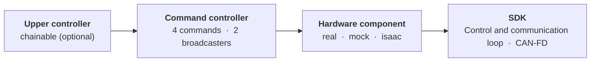

<div align="center">

<a href="https://www.aidinrobotics.co.kr/"></a>

<h1>AIDIN Hand Gen2 ROS 2</h1>

The `ros2_control` wrapper for the AIDIN Hand Gen2 C++ SDK. The SDK owns the CAN-FD communication, the drive state machine, the kinematics and the 500 Hz control and communication loop. The wrapper provides the hardware plugin, the controllers, the messages, the URDF and the launch files.

[](CHANGELOG.md) [](aidin_hand2.repos) [](#system-requirements)

[Build](#build-from-source) | [Documentation](#documentation) | [Changelog](CHANGELOG.md) | [Official Site](https://www.aidinrobotics.co.kr/) | English | [한국어](README.ko.md)

</div>

## Architecture

The wrapper adds no control algorithm.



The four command controllers convert a `~/command` topic or an upper controller's reference into one complete SDK command, and the two broadcasters publish the observation and the diagnostics. One message carries all 16 targets of one robot hand, and the effort limit and the controller tuning are parameters of the hardware component's own node.

## System Requirements

We verify the wrapper build and run on the configuration below.

| Component | Requirement |
|---|---|
| Operating System | Ubuntu 22.04 |
| ROS 2 | Humble |
| Control framework | `ros2_control` |
| SDK | `aidin_hand2` 0.5.x. [`aidin_hand2.repos`](aidin_hand2.repos) pins the revision |
| CAN interface | USB CAN-FD adapter (SocketCAN), 1 Mbit/s nominal, 5 Mbit/s data phase |

## Packages

The repository holds six packages.

| Package | Role |
|---|---|
| `aidin_hand2_hardware` | `SystemInterface` for the robot hand, the mock and Isaac Sim, with the SDK lifecycle and 4 services |
| `aidin_hand2_controllers` | 4 command controllers, `HandStateBroadcaster`, `DiagnosticsBroadcaster` |
| `aidin_hand2_msgs` | 4 command messages, `CommandState`, `HandState`, `HandDiagnostics` |
| `aidin_hand2_description` | URDF, xacro macros, meshes, `ros2_control` description |
| `aidin_hand2_bringup` | Launch files and controller configuration for the robot hand, the mock and Isaac Sim |
| `aidin_hand2_examples` | 4 chainable upper-controller skeletons |

## Build from source

Prepare the host first with [Real-time kernel setup](docs/ko/01_real_time_kernel_setup.md) and [CAN-FD setup](docs/ko/02_can_fd_setup.md). Then install the SDK and build the wrapper as [Installation](docs/ko/03_installation.md) describes. The commands below are a summary of that document.

```bash
sudo apt install -y ros-dev-tools ros-humble-ros2controlcli
cd ~/your_ws/src/aidin-hand2-ros2
vcs import .. < aidin_hand2.repos          # the SDK, into ~/your_ws/src/aidin-hand2-sdk
```

Build and install the SDK by following the SDK's own document, [SDK build & install](https://github.com/aidinrobotics/aidin-hand2-sdk/blob/main/docs/en/06_sdk_build_and_install.md), and choose the value that matches the kinematics of your robot hand at configure time. Then build the wrapper.

```bash
cd ~/your_ws
source /opt/ros/humble/setup.bash
rosdep install --from-paths src/aidin-hand2-ros2 --ignore-src --rosdistro humble -y
colcon build --symlink-install --cmake-args -DCMAKE_BUILD_TYPE=RelWithDebInfo
source install/setup.bash
```

## Quick start

The `aidin_hand2_bringup` package runs the robot hand standalone to check the installation and the hardware. Start with the mock, which needs no hardware.

```bash
ros2 launch aidin_hand2_bringup aidin_hand2_mock.launch.py
```

In another terminal, check the controllers.

```bash
ros2 control list_controllers
```

For the robot hand, start without homing and call the `~/home` service after you clear the area around the robot hand. The full procedure is in [Bringup](docs/ko/04_bringup.md).

```bash
ros2 launch aidin_hand2_bringup aidin_hand2.launch.py \
  use_right_hand:=false left_hand_interface:=can0 auto_home:=false
```

## Integration

To mount the robot hand on your own robot, call the two xacro macros from your URDF instead of using the launch files. One macro adds the links and the meshes, and the other declares the `ros2_control` hardware component.

```xml
<xacro:include filename="$(find aidin_hand2_description)/urdf/aidin_hand2_left.urdf.xacro"/>
<xacro:include filename="$(find aidin_hand2_description)/ros2_control/aidin_hand2.ros2_control.xacro"/>

<xacro:aidin_hand2_left prefix="left_" parent="your_tool_link">
  <origin xyz="0 0 0" rpy="0 0 0"/>
</xacro:aidin_hand2_left>

<xacro:aidin_hand2_ros2_control
  name="left_hand_control" prefix="left_" hand_side="left"
  can_interface="can0" auto_home="false"/>
```

Then declare the controllers in your own `controllers.yaml`. One command controller is active at a time, and a command reaches the command controller through the controller's `~/command` topic or, when the controller runs in chained mode, through the controller's reference interfaces. The procedure is in [Integration](docs/ko/05_integration.md).

## Documentation

We write the documents in Korean and plan an English translation. There are three groups of documents: setup, interfaces and appendix.

### Setup

- [Real-time kernel setup](docs/ko/01_real_time_kernel_setup.md) — PREEMPT_RT kernel and real-time permissions
- [CAN-FD setup](docs/ko/02_can_fd_setup.md) — configure the interface and name the interface in the wrapper
- [Installation](docs/ko/03_installation.md) — SDK install and wrapper build
- [Bringup](docs/ko/04_bringup.md) — mock, robot hand, homing, first command, stop
- [Integration](docs/ko/05_integration.md) — xacro macros and controllers in your own robot

### Interfaces

- [Controllers](docs/ko/06_controllers.md) — hardware component, lifecycle, command interfaces, mode switching, chaining, NaN rules
- [Services](docs/ko/07_services.md) — `~/run` `~/stop` `~/home` `~/reconnect`, homing, recovery, shutdown
- [Topics](docs/ko/08_topics.md) — command topics, `HandState`, `CommandState`, `HandDiagnostics`, monitoring
- [Parameters](docs/ko/09_parameters.md) — macro parameters, hardware node parameters, controller parameters
- [Launch files](docs/ko/10_launch_files.md) — the launch files, their arguments and config files
- [Chainable examples](aidin_hand2_examples/EXAMPLE.md) — upper-controller skeletons

### Appendix

- [Interface matrix](docs/ko/11_interface_matrix.md) — every interface name, enumerated
- [Troubleshooting](docs/ko/12_troubleshooting.md) — symptoms by layer, from build to communication

## Related repositories

- [aidin-hand2-sdk](https://github.com/aidinrobotics/aidin-hand2-sdk) — the C++ SDK. Its [C++ guide](https://github.com/aidinrobotics/aidin-hand2-sdk/blob/main/docs/en/07_cpp_usage_guide.md) explains the lifecycle, homing and command semantics that this wrapper exposes. [Workspace limits](https://github.com/aidinrobotics/aidin-hand2-sdk/blob/main/docs/en/14_workspace_limits.md) describes the reachable range that the SDK projects a joint target into, and [Error messages](https://github.com/aidinrobotics/aidin-hand2-sdk/blob/main/docs/en/15_error_messages.md) lists the text that a failed service returns.
