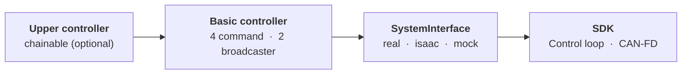

<div align="right"><sub><a href="README.ko.md">한국어</a></sub></div>

# AIDIN Hand Gen2 ROS 2 &nbsp;[](CHANGELOG.md) [](aidin_hand2.repos) [](#system-requirements)

A thin `ros2_control` wrapper around the AIDIN Hand Gen2 C++ SDK. The SDK owns the CAN-FD protocol, drive state machine, kinematics, and the 500 Hz control loop; this repository provides the hardware plugin, controllers, messages, URDF, and launch files.

## Architecture



No new controller layer is added. The four basic controllers act as command-port adapters that turn a ROS topic or an upper-controller reference into one complete typed SDK command.

Standalone, each controller's `~/command` carries one cycle's target and every accompanying value: joint position takes 16 targets plus a speed, joint impedance takes 16 targets plus 16 stiffness and 16 damping values. Partial updates are not accepted.

## System Requirements

| Component | Requirement |
|---|---|
| Operating System | Ubuntu 22.04 |
| ROS 2 | Humble |
| Control framework | `ros2_control` |
| SDK | `aidin_hand2` 0.3.x — see [`aidin_hand2.repos`](aidin_hand2.repos) |
| CAN interface | USB CAN-FD adapter (SocketCAN), 1 Mbit/s nominal / 5 Mbit/s data phase |

Prepare the host first: PREEMPT_RT and boot-time CAN-FD bring-up are covered by the SDK's [real-time kernel setup](https://github.com/aidinrobotics/aidin-hand2-sdk/blob/main/docs/en/04_real_time_kernel_setup.md) and [CAN-FD setup](https://github.com/aidinrobotics/aidin-hand2-sdk/blob/main/docs/en/05_can_fd_setup.md).

## Packages

| Package | Role |
|---|---|
| `aidin_hand2_hardware` | Real, Isaac Sim and mock `SystemInterface`, SDK lifecycle mapping |
| `aidin_hand2_controllers` | 4 command controllers, 2 broadcasters |
| `aidin_hand2_msgs` | 4 typed commands, `CommandState`, `HandState`, `HandDiagnostics` |
| `aidin_hand2_description` | URDF, xacro, meshes, ros2_control description |
| `aidin_hand2_bringup` | Real, Isaac Sim and mock launch files with controller config |
| `aidin_hand2_examples` | 4 chainable upper-controller skeletons, optional MANUS glove teleop |

## Build from source

Build and install the SDK first. The verified revision is pinned in `aidin_hand2.repos`:

```bash
vcs import .. < aidin_hand2.repos
```

```bash
cd <aidin-hand2-sdk>
cmake -S cpp -B cpp/build -DCMAKE_BUILD_TYPE=RelWithDebInfo
cmake --build cpp/build -j"$(nproc)"
sudo cmake --install cpp/build
```

To avoid sudo, install to a user prefix and put it on `CMAKE_PREFIX_PATH`:

```bash
cmake --install cpp/build --prefix "$HOME/.local"
export CMAKE_PREFIX_PATH="$HOME/.local${CMAKE_PREFIX_PATH:+:$CMAKE_PREFIX_PATH}"
```

Then build the wrapper from the workspace root. `/usr/local` is a default CMake search path, so no `CMAKE_PREFIX_PATH` is needed for a system install.

```bash
cd ~/your_ws
source /opt/ros/humble/setup.bash

colcon build --symlink-install --cmake-args -DCMAKE_BUILD_TYPE=RelWithDebInfo
source install/setup.bash
```

## Quick start

`aidin_hand2_bringup` launches the hand on its own — use it to verify the hardware, not as
the integration path. Always run the mock first:

```bash
ros2 launch aidin_hand2_bringup aidin_hand2_mock.launch.py
ros2 control list_controllers
```

For the real hand, start without homing and trigger it only after confirming the workspace is
clear. See [first bringup](docs/ko/02_first_bringup.md).

```bash
ros2 launch aidin_hand2_bringup aidin_hand2.launch.py auto_home:=false
```

## Integration

To mount the hand on your own robot, include our two xacro macros in your URDF instead of using
our launch files — one adds the links and meshes, the other declares the `ros2_control` system.
The geometry macro is per side (`aidin_hand2_left` / `aidin_hand2_right`); the `ros2_control`
macro takes `hand_side`. `can_interface` and the three identity arguments are required, and the
rest follow the SDK defaults.

```xml
<xacro:include filename="$(find aidin_hand2_description)/urdf/aidin_hand2_left.urdf.xacro"/>
<xacro:include filename="$(find aidin_hand2_description)/ros2_control/aidin_hand2.ros2_control.xacro"/>

<xacro:aidin_hand2_left prefix="left_" parent="your_tool_link">
  <origin xyz="0 0 0" rpy="0 0 0"/>
</xacro:aidin_hand2_left>

<xacro:aidin_hand2_ros2_control
  name="left_hand" prefix="left_" hand_side="left"
  can_interface="can0" auto_home="false"/>
```

Then declare the controllers in your own `controllers.yaml`. Command controllers claim
mode-specific interfaces, so exactly one may be active at a time; commands go either through
each controller's `~/command` topic or through its reference interfaces when chained.

See [ros2_control setup](docs/ko/03_setup.md) for the full parameter contract and both
command paths.

## Documentation

Written in Korean; an English translation is planned.

### Getting started

- [Installation](docs/ko/01_installation.md) — prerequisites, dependencies, SDK and wrapper build
- [First bringup](docs/ko/02_first_bringup.md) — mock, real hand, homing, first command, shutdown

### Using the hand

- [ros2_control setup](docs/ko/03_setup.md) — xacro macro contract and controller declaration
- [Interfaces](docs/ko/04_interfaces.md) — topics, services, reference interfaces, and command examples
- [Bringup example](docs/ko/05_bringup_example.md) — our standalone launch files and their arguments
- [Chainable examples](aidin_hand2_examples/EXAMPLE.md) — upper-controller skeletons for chaining

### Operations

- [Operations](docs/ko/06_operations.md) — lifecycle, auto reconnect, RT, monitoring, recovery
- [Troubleshooting](docs/ko/07_troubleshooting.md) — build, launch, controller, stale state, CAN diagnosis

### Appendix

- [Interface matrix](docs/ko/08_interface_matrix.md) — every interface name, enumerated

## Related repositories

- [aidin-hand2-sdk](https://github.com/aidinrobotics/aidin-hand2-sdk) — C++ SDK
- Web GUI (pending) — browser GUI and WebSocket bridge

### SDK documents you will need

The SDK owns host setup, kinematics, and the safety contract — this wrapper does not restate them.

- [Real-time kernel setup](https://github.com/aidinrobotics/aidin-hand2-sdk/blob/main/docs/en/04_real_time_kernel_setup.md) — PREEMPT_RT, required before real hardware
- [CAN-FD setup](https://github.com/aidinrobotics/aidin-hand2-sdk/blob/main/docs/en/05_can_fd_setup.md) — interface bring-up and boot automation
- [SDK build & install](https://github.com/aidinrobotics/aidin-hand2-sdk/blob/main/docs/en/06_sdk_build_and_install.md) — the build this wrapper consumes
- [Workspace limits](https://github.com/aidinrobotics/aidin-hand2-sdk/blob/main/docs/en/14_workspace_limits.md) — coupled workspace boundaries and command clamping
- [Safety](https://github.com/aidinrobotics/aidin-hand2-sdk/blob/main/docs/en/13_safety.md) — command persistence and comms-loss behavior
- [Troubleshooting](https://github.com/aidinrobotics/aidin-hand2-sdk/blob/main/docs/en/15_troubleshooting.md) — connection, RT, homing, and CAN errors
